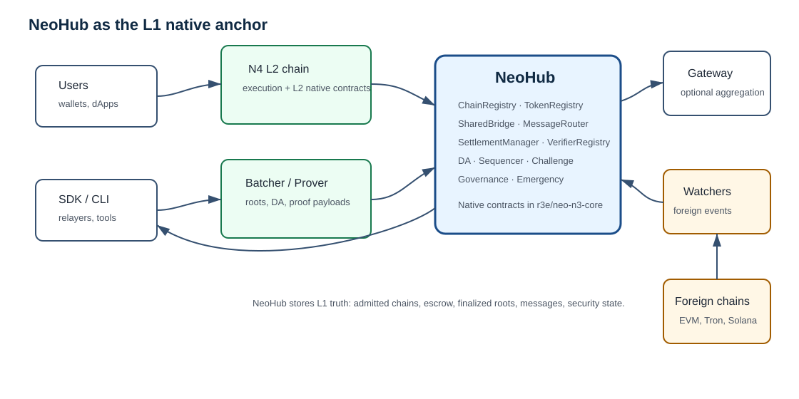
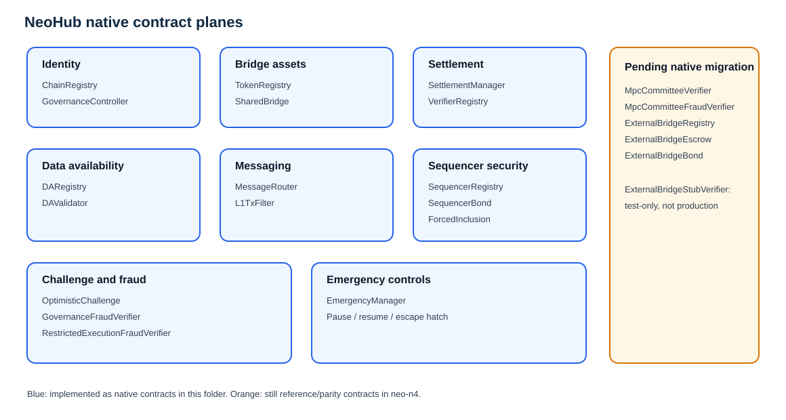
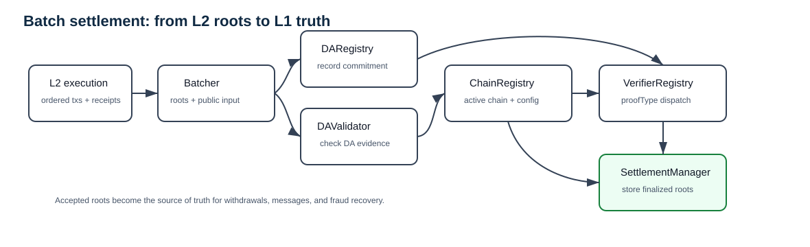
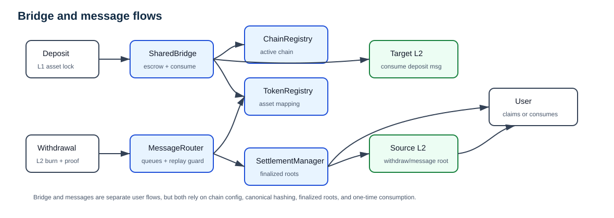
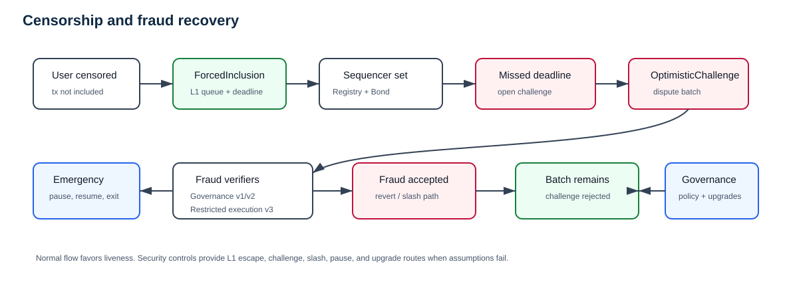

# NeoHub Native Contracts

NeoHub is the L1 native-contract surface for the Neo Elastic Network. This
folder keeps the production L1 implementation next to the documentation that
explains it. The contracts here are compiled into the `r3e/neo-n3-core` Neo
core fork and are available from genesis as native contracts.

The matching `contracts/NeoHub.*` projects in `r3e-network/neo-n4` remain useful
as reference/parity sources and deployment-rehearsal fixtures, but production
L1 ownership belongs here.

## Figures

| Figure | Purpose |
| --- | --- |
| [System context](figures/neohub-system-context.svg) | Shows where NeoHub sits between users, L2s, Gateway, watchers, and foreign chains. |
| [Contract planes](figures/neohub-contract-planes.svg) | Groups every NeoHub contract by responsibility and migration status. |
| [Settlement flow](figures/neohub-settlement-flow.svg) | Shows how a batch commitment becomes L1 truth. |
| [Bridge and message flow](figures/neohub-bridge-message-flow.svg) | Shows deposits, withdrawals, and message routing. |
| [Security flow](figures/neohub-security-flow.svg) | Shows forced inclusion, optimistic challenge, fraud verification, and emergency control. |

Chinese versions are kept beside the English figures with the `.zh.svg` suffix.
The Chinese text companion is [README.zh.md](README.zh.md).



## Folder layout

```text
NeoHub/
  NeoHubNativeContract.cs
  NeoHubChainRegistryContract.cs
  NeoHubTokenRegistryContract.cs
  ...
  README.md
  README.zh.md
  figures/
```

`NeoHubNativeContract.cs` contains shared helpers for witness checks, storage-key
encoding, fixed-width little-endian encoders, and common state reads/writes.
Each `NeoHub*Contract.cs` file owns exactly one native contract.

## Native contract planes



| Plane | Native contracts in this folder | Responsibility |
| --- | --- | --- |
| Chain identity | `NeoHubChainRegistryContract` | Registers L2 chains, stores the canonical 91-byte chain config, exposes security labels, and gates active/paused state. |
| Assets | `NeoHubTokenRegistryContract`, `NeoHubSharedBridgeContract` | Maps canonical L1 assets to L2 representations, escrows L1 assets, creates deposit messages, and finalizes withdrawals. |
| Settlement | `NeoHubSettlementManagerContract`, `NeoHubVerifierRegistryContract` | Accepts batch commitments, dispatches proof verification, records batch roots/status, and supplies roots to bridge/message consumers. |
| Data availability | `NeoHubDARegistryContract`, `NeoHubDAValidatorContract` | Records DA commitments and validates DA-mode-specific committee/DAC evidence. |
| Messaging | `NeoHubMessageRouterContract`, `NeoHubL1TxFilterContract` | Routes replay-protected L1-to-L2, L2-to-L1, and global-root messages, with optional per-chain enqueue policy. |
| Sequencer security | `NeoHubSequencerRegistryContract`, `NeoHubSequencerBondContract` | Tracks active sequencers, bond balances, slashing authority, and exit windows. |
| Censorship recovery | `NeoHubForcedInclusionContract` | Stores L1-posted forced transactions and deadlines that sequencers must include. |
| Challenge/fraud | `NeoHubOptimisticChallengeContract`, `NeoHubGovernanceFraudVerifierContract`, `NeoHubRestrictedExecutionFraudVerifierContract` | Coordinates optimistic challenges and verifies governance-mediated or restricted-execution fraud payloads. |
| Governance/safety | `NeoHubGovernanceControllerContract`, `NeoHubEmergencyManagerContract` | Controls admission, policy, upgrade routes, pause/resume, and emergency exit controls. |

External-bridge/MPC contracts still live in the `neo-n4` reference inventory and
must be migrated here before NeoHub is described as fully L1-native:
`MpcCommitteeVerifier`, `MpcCommitteeFraudVerifier`,
`ExternalBridgeRegistry`, `ExternalBridgeEscrow`, and `ExternalBridgeBond`.
`ExternalBridgeStubVerifier` is test-only and is not a production native target.

## System flow

NeoHub does not execute L2 transactions. L2 chains execute transactions and
produce roots. NeoHub enforces that roots are attached to an admitted chain,
the configured data-availability mode, the configured proof mode, and the bridge
and governance rules.

```text
L2 execution -> batch commitment -> NeoHub settlement -> finalized roots
finalized roots -> SharedBridge / MessageRouter -> user-visible claims
```

## Batch settlement workflow



1. The L2 batcher computes the batch roots: state, transaction, receipt,
   withdrawal, L2-to-L1 message, L2-to-L2 message, DA commitment, and public
   input hash.
2. `NeoHubDARegistryContract` records the DA commitment for the chain/batch.
3. `NeoHubSettlementManagerContract` receives the `BatchCommitment`.
4. `NeoHubChainRegistryContract` confirms the chain is active and reads its
   security settings.
5. `NeoHubDAValidatorContract` validates the DA evidence for the chain's DA mode.
6. `NeoHubVerifierRegistryContract` dispatches to the configured proof verifier.
7. If accepted, `SettlementManager` stores the canonical batch status and roots.
8. `SharedBridge` and `MessageRouter` later consume those roots for withdrawals
   and message proofs.

The load-bearing boundary is the combination of `SettlementManager`,
`VerifierRegistry`, `DAValidator`, and `ChainRegistry`. If those checks accept a
batch, bridge and message flows treat its roots as L1 truth.

## Bridge and message workflow



Deposits:

1. A user deposits an L1 asset into `NeoHubSharedBridgeContract`.
2. `SharedBridge` checks chain status through `ChainRegistry`.
3. `SharedBridge` resolves the asset route through `TokenRegistry`.
4. `MessageRouter` enqueues the L1-to-L2 deposit payload.
5. The target L2 consumes the message and mints or credits the bridged asset.

Withdrawals:

1. The user burns or locks the L2 asset representation.
2. The L2 includes a withdrawal record in the batch `withdrawalRoot`.
3. `SettlementManager` finalizes the batch root.
4. The user submits a Merkle proof to `SharedBridge`.
5. `SharedBridge` checks the finalized root and consumes the withdrawal once.

Messages:

1. L1, L2, or Gateway produces a canonical message envelope.
2. `MessageRouter` hashes source chain, target chain, nonce, sender, receiver,
   message type, and payload.
3. The target side proves and consumes the message once.

## Forced inclusion, challenge, and governance workflow



The security path is layered:

1. `NeoHubForcedInclusionContract` lets users post a transaction directly to L1
   when a sequencer censors them.
2. `NeoHubSequencerRegistryContract` identifies the active sequencer set.
3. `NeoHubSequencerBondContract` holds slashable stake and enforces exit windows.
4. `NeoHubOptimisticChallengeContract` opens and resolves batch challenges.
5. `NeoHubGovernanceFraudVerifierContract` validates structural v1/v2 fraud
   payloads for governance-mediated challenge paths.
6. `NeoHubRestrictedExecutionFraudVerifierContract` validates v3 storage-proof
   payloads by re-deriving pre/post roots.
7. `NeoHubEmergencyManagerContract` can pause dangerous paths and expose escape
   hatch behavior under the configured governance policy.

## Per-contract reference

| Contract | What it stores or validates | Main readers/callers |
| --- | --- | --- |
| `NeoHubChainRegistryContract` | Chain config, active state, governance controller reference. | Settlement, bridge, message router, governance. |
| `NeoHubTokenRegistryContract` | Asset mappings and token metadata for bridge routes. | Shared bridge, operator tooling. |
| `NeoHubDARegistryContract` | DA commitment by chain and batch. | Settlement manager, DA validator, auditors. |
| `NeoHubDAValidatorContract` | DA committee metadata and DA proof validation. | Settlement manager. |
| `NeoHubL1TxFilterContract` | Optional L1-to-L2 enqueue filter policy. | Message router. |
| `NeoHubVerifierRegistryContract` | Proof-type to verifier route. | Settlement manager, governance. |
| `NeoHubSettlementManagerContract` | Batch status, state roots, withdrawal roots, message roots. | Batcher, bridge, message router, challenge system. |
| `NeoHubSharedBridgeContract` | L1 escrow state, deposit nonce, consumed withdrawal markers. | Users, relayers, settlement manager. |
| `NeoHubMessageRouterContract` | L1-to-L2 queues, consumed L2-to-L1 messages, global roots. | Users, L2 nodes, Gateway, relayers. |
| `NeoHubEmergencyManagerContract` | Pause state, emergency controller, settlement/bridge references. | Security council, governance, bridge/settlement paths. |
| `NeoHubGovernanceControllerContract` | Governance admission mode, protocol policy, controller state. | Operator tooling, registries, upgrade paths. |
| `NeoHubSequencerBondContract` | Bond balances, slashers, exit windows. | Sequencers, challenge system, governance. |
| `NeoHubSequencerRegistryContract` | Active sequencer membership per chain. | Settlement/challenge readers, governance. |
| `NeoHubForcedInclusionContract` | Forced transaction queue and inclusion deadlines. | Users, sequencers, challenge tooling. |
| `NeoHubOptimisticChallengeContract` | Challenge state and accepted fraud markers. | Challengers, settlement manager, sequencer bond. |
| `NeoHubGovernanceFraudVerifierContract` | Stateless v1/v2 fraud-payload structure checks. | Optimistic challenge. |
| `NeoHubRestrictedExecutionFraudVerifierContract` | Stateless v3 storage-proof fraud-payload validation. | Optimistic challenge. |

## Audit reading order

When reviewing changes in this folder:

1. Start with `NeoHubNativeContract.cs` to understand helper behavior and storage
   key conventions.
2. Read `NeoHubChainRegistryContract.cs` because every flow is scoped by chain id.
3. Read `NeoHubSettlementManagerContract.cs` and
   `NeoHubVerifierRegistryContract.cs` because they define accepted L1 truth.
4. Read `NeoHubSharedBridgeContract.cs` and `NeoHubMessageRouterContract.cs`
   because they expose user-facing value and message flows.
5. Read `NeoHubDARegistryContract.cs` and `NeoHubDAValidatorContract.cs` because
   DA assumptions are part of settlement security.
6. Read sequencer, forced-inclusion, and challenge contracts together.
7. Read governance and emergency contracts last, then re-check the authority paths
   used by the previous contracts.

## Verification expectations

After changing any contract in this folder, run at minimum:

```powershell
dotnet test tests\Neo.UnitTests\Neo.UnitTests.csproj --filter FullyQualifiedName~UT_NeoHubNativeContracts --nologo /p:NuGetAudit=false
```

For shared helpers, settlement, bridge, or governance paths, run the full Neo
unit test suite:

```powershell
dotnet test tests\Neo.UnitTests\Neo.UnitTests.csproj --nologo /p:NuGetAudit=false
```
