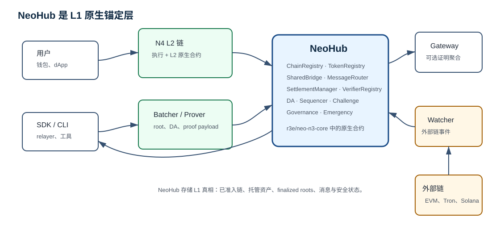
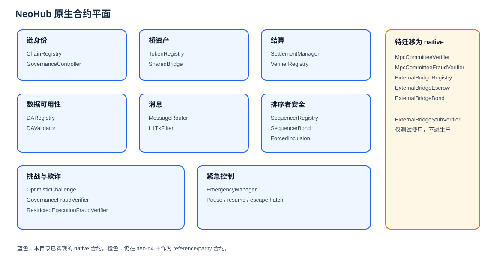
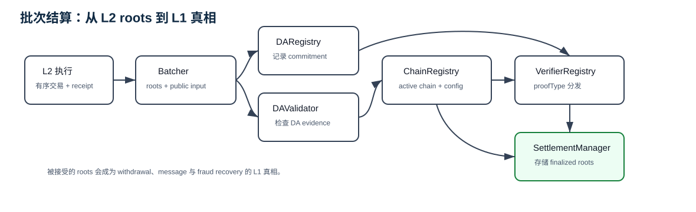
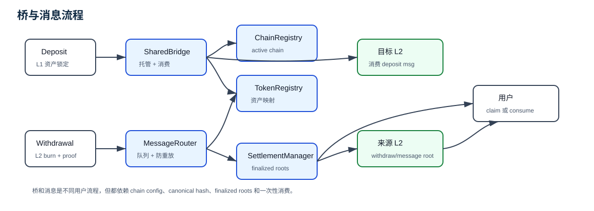
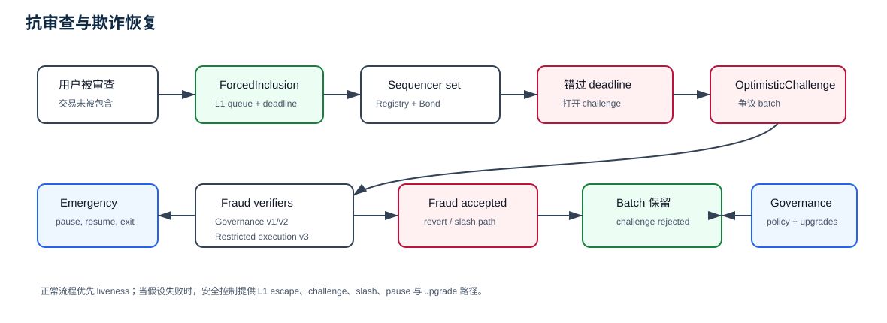

# NeoHub 原生合约

NeoHub 是 Neo Elastic Network 的 L1 原生合约层。这个目录把生产 L1 实现和解释
文档放在一起维护。这些合约会编入 `r3e/neo-n3-core` Neo core fork，并作为原生合约
从 genesis 起可用。

`r3e-network/neo-n4` 中对应的 `contracts/NeoHub.*` 项目仍然有价值：它们是参考
实现、parity 来源和部署演练夹具。但生产 L1 所有权在本目录。

## 图片

| 图片 | 用途 |
| --- | --- |
| [系统上下文](figures/neohub-system-context.zh.svg) | 展示 NeoHub 如何连接用户、L2、Gateway、watcher 和外部链。 |
| [合约平面](figures/neohub-contract-planes.zh.svg) | 按职责和迁移状态组织每个 NeoHub 合约。 |
| [结算流程](figures/neohub-settlement-flow.zh.svg) | 展示 batch commitment 如何成为 L1 真相。 |
| [桥与消息流程](figures/neohub-bridge-message-flow.zh.svg) | 展示 deposit、withdrawal 和消息路由。 |
| [安全流程](figures/neohub-security-flow.zh.svg) | 展示 forced inclusion、optimistic challenge、fraud verification 和 emergency control。 |

英文图片放在同一目录下，不带 `.zh.svg` 后缀。英文说明见 [README.md](README.md)。



## 目录结构

```text
NeoHub/
  NeoHubNativeContract.cs
  NeoHubChainRegistryContract.cs
  NeoHubTokenRegistryContract.cs
  ...
  README.md
  README.zh.md
  figures/
```

`NeoHubNativeContract.cs` 包含 witness 检查、storage-key 编码、固定宽度小端编码、
通用状态读写等共享 helper。每个 `NeoHub*Contract.cs` 文件只负责一个原生合约。

## 原生合约平面



| 平面 | 本目录中的原生合约 | 职责 |
| --- | --- | --- |
| 链身份 | `NeoHubChainRegistryContract` | 注册 L2 链，存储 canonical 91-byte chain config，暴露安全标签，控制 active/paused 状态。 |
| 资产 | `NeoHubTokenRegistryContract`, `NeoHubSharedBridgeContract` | 映射 L1 canonical asset 和 L2 表示，托管 L1 资产，创建 deposit message，finalize withdrawal。 |
| 结算 | `NeoHubSettlementManagerContract`, `NeoHubVerifierRegistryContract` | 接收 batch commitment，分发 proof verification，记录 batch roots/status，并向 bridge/message 提供 root。 |
| 数据可用性 | `NeoHubDARegistryContract`, `NeoHubDAValidatorContract` | 记录 DA commitment，校验 DA mode 对应的 committee/DAC evidence。 |
| 消息 | `NeoHubMessageRouterContract`, `NeoHubL1TxFilterContract` | 路由防重放的 L1-to-L2、L2-to-L1 和 global-root message，并提供可选 per-chain enqueue policy。 |
| 排序者安全 | `NeoHubSequencerRegistryContract`, `NeoHubSequencerBondContract` | 跟踪 active sequencer、bond balance、slashing authority 和 exit window。 |
| 抗审查恢复 | `NeoHubForcedInclusionContract` | 存储用户在 L1 发布的 forced transaction 和 inclusion deadline。 |
| 挑战/欺诈 | `NeoHubOptimisticChallengeContract`, `NeoHubGovernanceFraudVerifierContract`, `NeoHubRestrictedExecutionFraudVerifierContract` | 协调 optimistic challenge，校验治理仲裁或 restricted execution fraud payload。 |
| 治理/安全 | `NeoHubGovernanceControllerContract`, `NeoHubEmergencyManagerContract` | 控制准入、策略、升级路径、pause/resume 和 emergency exit。 |

外部桥和 MPC 合约仍在 `neo-n4` 参考 inventory 中，迁入本目录之前不能声称 NeoHub
已完全 L1-native：`MpcCommitteeVerifier`、`MpcCommitteeFraudVerifier`、
`ExternalBridgeRegistry`、`ExternalBridgeEscrow`、`ExternalBridgeBond`。
`ExternalBridgeStubVerifier` 只用于测试，不是生产 native 目标。

## 系统流

NeoHub 不执行 L2 交易。L2 链执行交易并产出 root。NeoHub 强制检查这些 root 是否属于
已准入链、是否符合配置的 DA mode、proof mode、桥规则和治理规则。

```text
L2 execution -> batch commitment -> NeoHub settlement -> finalized roots
finalized roots -> SharedBridge / MessageRouter -> user-visible claims
```

## 批次结算流程



1. L2 batcher 计算 batch roots：state、transaction、receipt、withdrawal、
   L2-to-L1 message、L2-to-L2 message、DA commitment 和 public input hash。
2. `NeoHubDARegistryContract` 记录该 chain/batch 的 DA commitment。
3. `NeoHubSettlementManagerContract` 接收 `BatchCommitment`。
4. `NeoHubChainRegistryContract` 确认链处于 active 状态，并读取安全设置。
5. `NeoHubDAValidatorContract` 根据该链的 DA mode 校验 DA evidence。
6. `NeoHubVerifierRegistryContract` 分发到配置的 proof verifier。
7. 如果通过，`SettlementManager` 存储 canonical batch status 和 roots。
8. `SharedBridge` 和 `MessageRouter` 后续消费这些 roots 来校验 withdrawal 和 message proof。

核心信任边界是 `SettlementManager`、`VerifierRegistry`、`DAValidator` 与
`ChainRegistry` 的组合。如果这些检查接受一个 batch，桥和消息流程就会把它的 roots
视为 L1 真相。

## 桥与消息流程



Deposit：

1. 用户把 L1 资产 deposit 到 `NeoHubSharedBridgeContract`。
2. `SharedBridge` 通过 `ChainRegistry` 检查链状态。
3. `SharedBridge` 通过 `TokenRegistry` 解析资产路由。
4. `MessageRouter` enqueue L1-to-L2 deposit payload。
5. 目标 L2 消费 message，并 mint 或 credit bridged asset。

Withdrawal：

1. 用户 burn 或 lock L2 资产表示。
2. L2 把 withdrawal record 放入 batch `withdrawalRoot`。
3. `SettlementManager` finalize 包含该 root 的 batch。
4. 用户向 `SharedBridge` 提交 Merkle proof。
5. `SharedBridge` 检查 finalized root，并只消费一次 withdrawal。

Message：

1. L1、L2 或 Gateway 生成 canonical message envelope。
2. `MessageRouter` 对 source chain、target chain、nonce、sender、receiver、
   message type 和 payload 做 canonical hash。
3. 目标侧证明并消费 message，且只能消费一次。

## Forced inclusion、challenge 与治理流程



安全路径是分层的：

1. `NeoHubForcedInclusionContract` 允许用户在排序者审查时直接把交易发布到 L1。
2. `NeoHubSequencerRegistryContract` 标识 active sequencer set。
3. `NeoHubSequencerBondContract` 持有可 slash stake 并强制 exit window。
4. `NeoHubOptimisticChallengeContract` 打开并解决 batch challenge。
5. `NeoHubGovernanceFraudVerifierContract` 校验治理仲裁路径使用的 v1/v2 structural fraud payload。
6. `NeoHubRestrictedExecutionFraudVerifierContract` 通过重新推导 pre/post roots 校验 v3 storage-proof payload。
7. `NeoHubEmergencyManagerContract` 可以在配置的治理策略下 pause 危险路径并开放 escape hatch。

## 单合约参考

| 合约 | 存储或校验什么 | 主要读取方/调用方 |
| --- | --- | --- |
| `NeoHubChainRegistryContract` | Chain config、active 状态、governance controller 引用。 | Settlement、bridge、message router、governance。 |
| `NeoHubTokenRegistryContract` | 桥路由需要的 asset mapping 和 token metadata。 | Shared bridge、operator tooling。 |
| `NeoHubDARegistryContract` | 每个 chain/batch 的 DA commitment。 | Settlement manager、DA validator、auditor。 |
| `NeoHubDAValidatorContract` | DA committee metadata 和 DA proof validation。 | Settlement manager。 |
| `NeoHubL1TxFilterContract` | 可选 L1-to-L2 enqueue filter policy。 | Message router。 |
| `NeoHubVerifierRegistryContract` | Proof-type 到 verifier 的路由。 | Settlement manager、governance。 |
| `NeoHubSettlementManagerContract` | Batch status、state root、withdrawal root、message root。 | Batcher、bridge、message router、challenge system。 |
| `NeoHubSharedBridgeContract` | L1 escrow state、deposit nonce、consumed withdrawal marker。 | 用户、relayer、settlement manager。 |
| `NeoHubMessageRouterContract` | L1-to-L2 queue、consumed L2-to-L1 message、global root。 | 用户、L2 node、Gateway、relayer。 |
| `NeoHubEmergencyManagerContract` | Pause state、emergency controller、settlement/bridge 引用。 | Security council、governance、bridge/settlement path。 |
| `NeoHubGovernanceControllerContract` | Governance admission mode、protocol policy、controller state。 | Operator tooling、registry、upgrade path。 |
| `NeoHubSequencerBondContract` | Bond balance、slasher、exit window。 | Sequencer、challenge system、governance。 |
| `NeoHubSequencerRegistryContract` | 每条链的 active sequencer membership。 | Settlement/challenge reader、governance。 |
| `NeoHubForcedInclusionContract` | Forced transaction queue 和 inclusion deadline。 | 用户、sequencer、challenge tooling。 |
| `NeoHubOptimisticChallengeContract` | Challenge state 和 accepted fraud marker。 | Challenger、settlement manager、sequencer bond。 |
| `NeoHubGovernanceFraudVerifierContract` | Stateless v1/v2 fraud-payload structure check。 | Optimistic challenge。 |
| `NeoHubRestrictedExecutionFraudVerifierContract` | Stateless v3 storage-proof fraud-payload validation。 | Optimistic challenge。 |

## 审计阅读顺序

审阅本目录改动时：

1. 先读 `NeoHubNativeContract.cs`，理解 helper 行为和 storage key 约定。
2. 再读 `NeoHubChainRegistryContract.cs`，因为所有流程都由 chain id 限定。
3. 再读 `NeoHubSettlementManagerContract.cs` 和 `NeoHubVerifierRegistryContract.cs`，
   因为它们定义 L1 接受哪些状态为真相。
4. 再读 `NeoHubSharedBridgeContract.cs` 和 `NeoHubMessageRouterContract.cs`，
   因为它们暴露用户可见的资产和消息流程。
5. 再读 `NeoHubDARegistryContract.cs` 和 `NeoHubDAValidatorContract.cs`，
   因为 DA 假设是结算安全的一部分。
6. 把 sequencer、forced-inclusion 和 challenge 合约放在一起读。
7. 最后读 governance 和 emergency 合约，然后回头重新核对前面合约使用的权限路径。

## 验证要求

修改本目录任何合约后，至少运行：

```powershell
dotnet test tests\Neo.UnitTests\Neo.UnitTests.csproj --filter FullyQualifiedName~UT_NeoHubNativeContracts --nologo /p:NuGetAudit=false
```

如果修改 shared helpers、settlement、bridge 或 governance 路径，运行完整 Neo 单元测试：

```powershell
dotnet test tests\Neo.UnitTests\Neo.UnitTests.csproj --nologo /p:NuGetAudit=false
```
